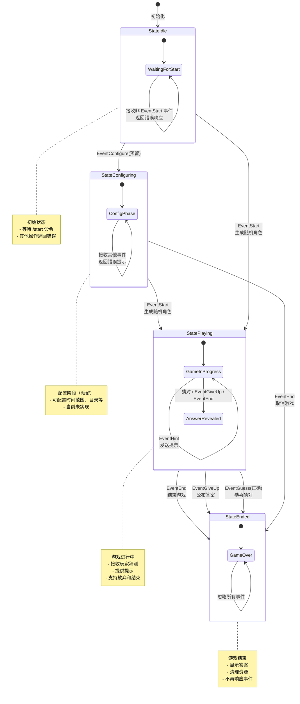

##  介绍

冻鳗糕手(frozen eel bot)：一个基于 Agentic AI 的 im 动漫猜谜游戏robot

基本数据流 v1


## 目录结构
```text
.
├── .env.example    # 模板环境文件（存放 telegram token，llm api key 等）
├── adapter         # im 适配层 （适配不同的 im 软件）
├── agent           # agent 层  
├── cmd     
├── game            # 游戏逻辑层
├── go.mod
├── internal        # 内部包
├── LICENSE
├── prompt          # prompt 模板
├── README.md   
└── store           # 存储层
    ├── mongo
    └── store.go
```

每个包入口有同名 `.go` 文件，定义核心接口，实现放在次级目录比如 `store/mongo`

## 游戏状态机
